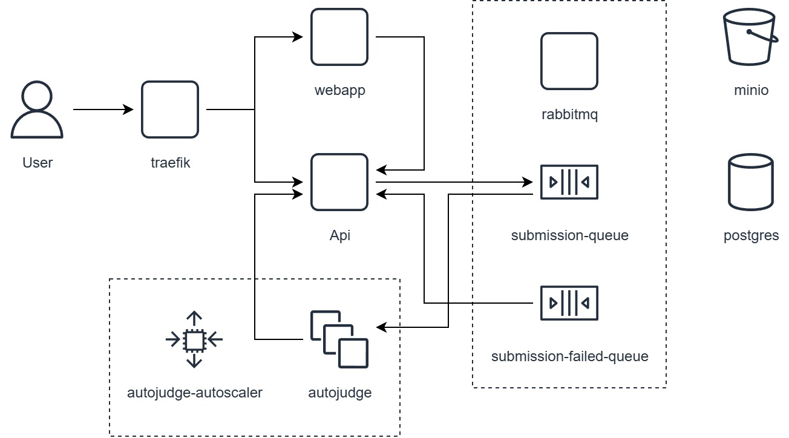
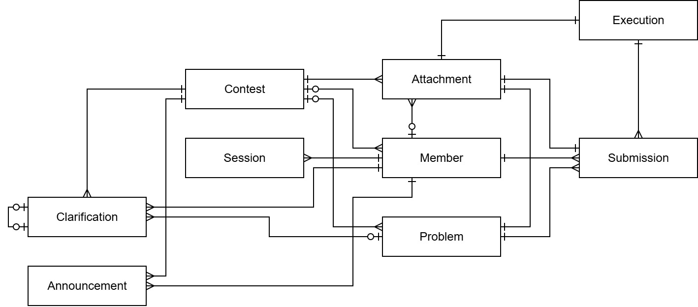

# Development

## Architecture

The forseti judge platform is built on a distributed architecture, designed to handle competitive programming contests at scale.



### Traefik

Entry point for the Docker Swarm, responsible for load balancing, HTTPS termination, and rate limiting.

### WebApp

Next.js server responsible for serving the user interface as static content.

### API

JVM service that provides an HTTP interface to the platform's use cases and business rules. It also exposes a WebSocket endpoint that emits contest updates in real-time. Created submissions are enqueued in the `submission-queue`. The service consumes messages from the `submission-failed-queue` to emit failures through its WebSocket connection.

#### WebSocket Fanout Mechanism

Since the API service runs as multiple replicas in a distributed environment, special handling is required to ensure all connected clients receive WebSocket messages regardless of which replica they're connected to. The platform uses a fanout mechanism via RabbitMQ to achieve this:

1. **Message Production**: When an event occurs (new submission, announcement, etc.), the API service uses `WebSocketFanoutProducer` to send the message to a RabbitMQ fanout exchange (`websocket-exchange`)

2. **Fanout Distribution**: Each API replica has a `StompWebSocketFanoutRabbitMQConsumer` that automatically creates a temporary, exclusive queue bound to the fanout exchange. RabbitMQ's fanout exchange broadcasts every message to all bound queues

3. **Local Emission**: Each replica receives the fanout message and forwards it to its local WebSocket clients via the STOMP messaging template

This ensures that all connected clients receive real-time updates regardless of which API replica generated the original event or which replica they're connected to for WebSocket communication.

### Autojudge

JVM service that consumes messages from the `submission-queue`, executes submission code in isolated sandbox environments, judges the results, and sends them back to the API.

This service is automatically scaled by the `autojudge-autoscaler` based on the number of messages in the `submission-queue`.

#### Docker Execution Environment

The autojudge service uses Docker containers to execute submission code in a secure, isolated environment. The execution process is handled by the `DockerSubmissionRunner`:

##### Security Features

Docker containers are created with strict security restrictions:

- **Network isolation**: `--network=none` prevents any network access
- **Capability dropping**: `--cap-drop=ALL` removes all Linux capabilities
- **Privilege restrictions**: `--security-opt=no-new-privileges` prevents privilege escalation
- **Process limits**: `--pids-limit=64` restricts the number of processes
- **Resource limits**: CPU and memory are strictly controlled based on problem constraints

##### Execution Flow

1. **Container Setup**: Creates a secure Docker container using language-specific images (e.g., `forseti-sb-cpp17`, `forseti-sb-java21`, `forseti-sb-python312`)

2. **Code Preparation**: Downloads submission code from MinIO storage and copies it to the container's `/app` directory

3. **Compilation** (if needed): For compiled languages like C++ and Java, runs compilation commands inside the container:
   - C++: `g++ -o a.out {file} -O2 -std=c++17 -DONLINE_JUDGE`
   - Java: Compilation with appropriate flags and classpath setup

4. **Test Case Execution**: Iterates through test cases from the problem's CSV file:
   - Executes code with input via stdin
   - Enforces time and memory limits using `timeout` command
   - Captures output and compares with expected results
   - Stops on first failure (fail-fast approach)

5. **Result Evaluation**: Determines final answer based on execution results:
   - `ACCEPTED`: All test cases passed
   - `WRONG_ANSWER`: Output doesn't match expected result
   - `TIME_LIMIT_EXCEEDED`: Execution exceeded time limit
   - `MEMORY_LIMIT_EXCEEDED`: Process killed due to memory limit (OOM)
   - `RUNTIME_ERROR`: Unexpected execution error
   - `COMPILATION_ERROR`: Code failed to compile

6. **Cleanup**: Container is automatically killed and removed after execution

##### Language Support

Each supported language has its own configuration defining:
- Docker image to use
- Compilation command (if applicable)
- Execution command
- Runtime environment setup

This approach ensures consistent, secure execution while supporting multiple programming languages with their specific requirements.

### RabbitMQ

Message broker that manages queues, exchanges, and routing for asynchronous communication between services.

#### Exchanges

- **submission-exchange** (direct): Routes submission messages to the autojudge service
- **submission-failed-exchange** (direct): Handles failed submissions as dead letter exchange for submission-queue
- **submission-dlq-exchange** (direct): Dead letter exchange for submission-failed-queue
- **websocket-exchange** (fanout): Broadcasts WebSocket messages to all API replicas

#### Queues and Routing

- **submission-queue**: 
  - Queue of submissions waiting to be executed by the autojudge
  - Bound to `submission-exchange` with routing key `submission-routing-key`
  - Dead letter exchange: `submission-failed-exchange` (messages go here on failure/rejection)

- **submission-failed-queue**: 
  - Queue of submissions that failed to be judged
  - Bound to `submission-failed-exchange` with routing key `submission-failed-routing-key`
  - Acts as the Dead Letter Queue (DLQ) for `submission-queue`
  - Dead letter exchange: `submission-dlq-exchange` (messages go here on retry exhaustion)

- **submission-dlq**: 
  - Final dead letter queue for submissions that cannot be processed
  - Bound to `submission-dlq-exchange` with routing key `submission-dlq-routing-key`
  - Messages here require manual intervention

- **WebSocket fanout queues**: 
  - Temporary, exclusive, auto-delete queues created by each API replica
  - Bound to `websocket-exchange` (fanout type ensures all replicas receive messages)
  - No routing key needed due to fanout exchange behavior

### MinIO

S3-compatible object storage that stores blobs such as submission code, problem statements, problem test cases, and execution outputs.

### Postgres

PostgreSQL database that stores all relational data for the platform.

## Domain

### Entities

All entities inherit from `BaseEntity`, which provides common fields for identity, timestamps, and soft deletion.



#### Contest

Represents a competitive programming contest.

| attribute      | type            | description                                          | default       |
| -------------- | --------------- | ---------------------------------------------------- | ------------- |
| id             | uuid            | Unique identifier                                    | random_uuid() |
| createdAt      | timestamp       | Timestamp of creation                                | now()         |
| updatedAt      | timestamp       | Timestamp of last update                             | now()         |
| deletedAt      | timestamp?      | Timestamp of deletion (soft delete)                  | null          |
| slug           | string          | Unique identifier used in URLs                       |               |
| title          | string          | Title of the contest                                 |               |
| languages      | Language[]      | List of programming languages allowed in the contest |               |
| startAt        | timestamp       | Timestamp when the contest starts                    |               |
| endAt          | timestamp       | Timestamp when the contest ends                      |               |
| settings       | Settings        | Configuration parameters for the contest             | Settings()    |
| members        | Member[]        | List of members in the contest                       | []            |
| problems       | Problem[]       | List of problems in the contest                      | []            |
| clarifications | Clarification[] | List of clarifications made in the contest           | []            |
| announcements  | Announcement[]  | List of announcements made in the contest            | []            |
| version        | int             | Version number for optimistic locking                | 1             |

##### Settings

| attribute          | type    | description                                   | default |
| ------------------ | ------- | --------------------------------------------- | ------- |
| isAutoJudgeEnabled | boolean | Controls if autojudge is enabled for contests | true    |

##### Language

| value      | description |
| ---------- | ----------- |
| CPP_17     | C++ 17      |
| JAVA_21    | Java 21     |
| PYTHON_312 | Python 3.12 |

#### Member

Represents a user or participant in the platform or a specific contest.

| attribute   | type         | description                             | default       |
| ----------- | ------------ | --------------------------------------- | ------------- |
| id          | uuid         | Unique identifier                       | random_uuid() |
| createdAt   | timestamp    | Timestamp of creation                   | now()         |
| updatedAt   | timestamp    | Timestamp of last update                | now()         |
| deletedAt   | timestamp?   | Timestamp of deletion (soft delete)     | null          |
| contest     | Contest?     | Contest to which this member belongs    | null          |
| type        | Type         | Type of member (role)                   |               |
| name        | string       | Name of the member or team              |               |
| login       | string       | Login identifier                        |               |
| password    | string       | Hashed password for authentication      |               |
| submissions | Submission[] | List of submissions made by this member | []            |
| version     | int          | Version number for optimistic locking   | 1             |

##### Type

| value      | description                                                     |
| ---------- | --------------------------------------------------------------- |
| ROOT       | Administrator with full privileges across all contests          |
| AUTOJUDGE  | Worker service that judges submissions                          |
| CONTESTANT | Participant in a contest                                        |
| JUDGE      | Jury member responsible for judging submissions                 |
| ADMIN      | Contest administrator with privileges within a specific contest |

#### Problem

Represents a programming problem in a contest.

| attribute   | type         | description                                       | default       |
| ----------- | ------------ | ------------------------------------------------- | ------------- |
| id          | uuid         | Unique identifier                                 | random_uuid() |
| createdAt   | timestamp    | Timestamp of creation                             | now()         |
| updatedAt   | timestamp    | Timestamp of last update                          | now()         |
| deletedAt   | timestamp?   | Timestamp of deletion (soft delete)               | null          |
| contest     | Contest      | Contest to which this problem belongs             |               |
| letter      | char         | Letter identifier for the problem (e.g., A, B, C) |               |
| title       | string       | Title of the problem                              |               |
| description | Attachment   | Problem description attachment                    |               |
| timeLimit   | int          | Time limit for execution in milliseconds          |               |
| memoryLimit | int          | Memory limit in megabytes                         |               |
| testCases   | Attachment   | Test cases attachment for judging                 |               |
| submissions | Submission[] | List of submissions made for this problem         | []            |
| version     | int          | Version number for optimistic locking             | 1             |

#### Submission

Represents a code submission for a problem.

| attribute  | type        | description                            | default       |
| ---------- | ----------- | -------------------------------------- | ------------- |
| id         | uuid        | Unique identifier                      | random_uuid() |
| createdAt  | timestamp   | Timestamp of creation                  | now()         |
| updatedAt  | timestamp   | Timestamp of last update               | now()         |
| deletedAt  | timestamp?  | Timestamp of deletion (soft delete)    | null          |
| member     | Member      | Member who made the submission         |               |
| problem    | Problem     | Problem being solved                   |               |
| language   | Language    | Programming language used              |               |
| status     | Status      | Current judging status                 |               |
| answer     | Answer      | Judging result                         | NO_ANSWER     |
| code       | Attachment  | Code attachment                        |               |
| executions | Execution[] | List of executions for this submission | []            |
| version    | int         | Version number for optimistic locking  | 1             |

##### Status

| value   | description                                 |
| ------- | ------------------------------------------- |
| JUDGING | Submission is currently being judged        |
| FAILED  | Submission failed to be judged by autojudge |
| JUDGED  | Submission has been judged                  |

##### Answer

| value                 | description                             |
| --------------------- | --------------------------------------- |
| NO_ANSWER             | No answer yet (before judging)          |
| ACCEPTED              | Submission passed all test cases        |
| WRONG_ANSWER          | Submission produced incorrect output    |
| COMPILATION_ERROR     | Code failed to compile                  |
| RUNTIME_ERROR         | Runtime error occurred during execution |
| TIME_LIMIT_EXCEEDED   | Execution exceeded the time limit       |
| MEMORY_LIMIT_EXCEEDED | Execution exceeded the memory limit     |

##### Language

| value      | description |
| ---------- | ----------- |
| CPP_17     | C++ 17      |
| JAVA_21    | Java 21     |
| PYTHON_312 | Python 3.12 |

#### Execution

Represents a single execution of a submission against test cases.

| attribute      | type       | description                          | default       |
| -------------- | ---------- | ------------------------------------ | ------------- |
| id             | uuid       | Unique identifier                    | random_uuid() |
| createdAt      | timestamp  | Timestamp of creation                | now()         |
| updatedAt      | timestamp  | Timestamp of last update             | now()         |
| deletedAt      | timestamp? | Timestamp of deletion (soft delete)  | null          |
| submission     | Submission | Submission being executed            |               |
| answer         | Answer     | Result of the execution              |               |
| totalTestCases | int        | Total number of test cases           | 1             |
| lastTestCase   | int?       | Index of the last test case executed | null          |
| input          | Attachment | Input attachment for the execution   |               |
| output         | Attachment | Output attachment from the execution |               |
| version        | int        | Version number for optimistic locking | 1            |

#### Clarification

Represents a question and answer thread about a contest or problem.

| attribute | type            | description                                   | default       |
| --------- | --------------- | --------------------------------------------- | ------------- |
| id        | uuid            | Unique identifier                             | random_uuid() |
| createdAt | timestamp       | Timestamp of creation                         | now()         |
| updatedAt | timestamp       | Timestamp of last update                      | now()         |
| deletedAt | timestamp?      | Timestamp of deletion (soft delete)           | null          |
| contest   | Contest         | Contest to which this clarification belongs   |               |
| member    | Member          | Member who created the clarification          |               |
| problem   | Problem?        | Problem related to the clarification (if any) | null          |
| parent    | Clarification?  | Parent clarification (if this is a response)  | null          |
| text      | string          | Text content of the question or answer        |               |
| children  | Clarification[] | List of responses to this clarification       | []            |
| version   | int             | Version number for optimistic locking         | 1             |

#### Announcement

Represents an official announcement in a contest.

| attribute | type       | description                                | default       |
| --------- | ---------- | ------------------------------------------ | ------------- |
| id        | uuid       | Unique identifier                          | random_uuid() |
| createdAt | timestamp  | Timestamp of creation                      | now()         |
| updatedAt | timestamp  | Timestamp of last update                   | now()         |
| deletedAt | timestamp? | Timestamp of deletion (soft delete)        | null          |
| contest   | Contest    | Contest to which this announcement belongs |               |
| member    | Member     | Member who made the announcement           |               |
| text      | string     | Text content of the announcement           |               |
| version   | int        | Version number for optimistic locking      | 1             |

#### Attachment

Represents a file attachment stored in object storage.

| attribute   | type       | description                                 | default       |
| ----------- | ---------- | ------------------------------------------- | ------------- |
| id          | uuid       | Unique identifier                           | random_uuid() |
| createdAt   | timestamp  | Timestamp of creation                       | now()         |
| updatedAt   | timestamp  | Timestamp of last update                    | now()         |
| deletedAt   | timestamp? | Timestamp of deletion (soft delete)         | null          |
| contest     | Contest    | Contest to which this attachment belongs    |               |
| member      | Member?    | Member who uploaded the attachment (if any) | null          |
| filename    | string     | Original filename                           |               |
| contentType | string     | MIME type of the file                       |               |
| context     | Context    | Purpose of the attachment                   |               |
| version     | int        | Version number for optimistic locking       | 1             |

##### Context

| value               | description                  |
| ------------------- | ---------------------------- |
| PROBLEM_DESCRIPTION | Problem description file     |
| PROBLEM_TEST_CASES  | Test cases for a problem     |
| SUBMISSION_CODE     | Source code for a submission |
| EXECUTION_OUTPUT    | Output from a code execution |

#### Session

Represents an authentication session for a member.

| attribute | type       | description                          | default       |
| --------- | ---------- | ------------------------------------ | ------------- |
| id        | uuid       | Unique identifier                    | random_uuid() |
| createdAt | timestamp  | Timestamp of creation                | now()         |
| updatedAt | timestamp  | Timestamp of last update             | now()         |
| deletedAt | timestamp? | Timestamp of deletion (soft delete)  | null          |
| csrfToken | string     | CSRF token for the session           |               |
| member    | Member     | Member to which this session belongs |               |
| expiresAt | timestamp  | Timestamp when the session expires   |               |
| version   | int        | Version number for optimistic locking | 1             |

## API

### Authorization

Authorization is stateful using a cookie-based session mechanism:

#### Session Management

- Sessions are stored in the database and referenced by a `session_id` cookie
- The cookie is `HttpOnly` to prevent XSS attacks
- Cookie `SameSite` attribute is set to `None` (with `Secure`) for production or `Lax` for development
- Sessions have an expiration time (`expiresAt`) that is validated on each request
- The `HttpContextExtractionFilter` extracts the session from cookies and validates it before processing requests
- All state-changing requests require a CSRF token to be sent in the `X-CSRF-Token` header, matching the token stored in the session

#### Endpoint Protection

Endpoints are protected using the `@Private` annotation:

- **`@Private`** - Requires any authenticated user
- **`@Private(Member.Type.ADMIN)`** - Requires ADMIN user
- **`@Private(Member.Type.JUDGE, Member.Type.ADMIN)`** - Requires either JUDGE or ADMIN user

The `HttpPrivateInterceptor` enforces these restrictions by:

1. Checking if a session exists in the request context
2. Validating the user's member type against allowed types
3. Returning `401 Unauthorized` if no session exists
4. Returning `403 Forbidden` if the user type is not allowed

#### Additional Authorization Checks

Beyond the `@Private` annotation, endpoints may enforce additional authorization rules:

- **Contest Membership** - Some endpoints verify that the authenticated member belongs to the specific contest being accessed
- **Contest State** - Certain endpoints check if a contest has started before allowing access (ROOT and ADMIN users bypass this check)
- **Resource Ownership** - Operations on specific resources may verify that the user owns or has permission to modify them

These checks are applied dynamically based on the endpoint's business logic and complement the role-based access control provided by the `@Private` annotation.

#### Root User Privilege

The ROOT user has bypass access to all endpoints and authorization checks, regardless of `@Private` annotations or custom filters.

### HTTP Endpoints

All endpoints are prefixed with `/api`. This is important for Traefik to expose publicly only required paths.

#### Root

**[POST] /v1/root:sign-in**

Sign in as root

**Authorization:** Public

**Request Body**

```json
{
  "password": "string"
}
```

**Response Body**

```json
{
  "id": "uuid",
  "member": {
    "id": "uuid",
    "type": "Member.Type",
    "name": "string"
  },
  "expiresAt": "timestamp"
}
```

#### Session

**[GET] /v1/sessions/me**

Get current session

**Authorization:** All authenticated users

**Response Body**

```json
{
  "id": "uuid",
  "member": {
    "id": "uuid",
    "type": "Member.Type",
    "name": "string"
  },
  "expiresAt": "timestamp",
  "version": 1
}
```

**[DELETE] /v1/sessions/me**

Delete current session (logout)

**Authorization:** All authenticated users

**Response:** 204 No Content

#### Contest

**[POST] /v1/root/contests**

Create a contest

**Authorization:** Root

**Request Body**

```json
{
  "slug": "string",
  "title": "string",
  "languages": ["Language"],
  "startAt": "timestamp",
  "endAt": "timestamp",
  "settings": {
    "isAutoJudgeEnabled": "boolean"
  },
  "version": 1
}
```

**Response Body**

```json
{
  "id": "uuid",
  "slug": "string",
  "title": "string",
  "languages": ["Language"],
  "startAt": "timestamp",
  "endAt": "timestamp",
  "autoFreezeAt": "timestamp",
  "settings": {
    "isAutoJudgeEnabled": "boolean"
  },
  "members": [],
  "problems": [],
  "clarifications": [],
  "announcements": [],
  "version": 1
}
```

**[PUT] /v1/contests/{contestId}**

Update a contest

**Authorization:** Admin

**Request Body**

```json
{
  "id": "uuid",
  "slug": "string",
  "title": "string",
  "languages": ["Language"],
  "startAt": "timestamp",
  "endAt": "timestamp",
  "autoFreezeAt": "timestamp",
  "settings": {
    "isAutoJudgeEnabled": "boolean"
  },
  "members": [],
  "problems": [],
  "clarifications": [],
  "announcements": [],
  "version": 1
}
```

**Response Body**

```json
{
  "id": "uuid",
  "slug": "string",
  "title": "string",
  "languages": ["Language"],
  "startAt": "timestamp",
  "endAt": "timestamp",
  "settings": {
    "isAutoJudgeEnabled": "boolean"
  },
  "members": [],
  "problems": [],
  "clarifications": [],
  "announcements": []
}
```

**[GET] /v1/root/contests/metadata**

Find all contest metadata

**Authorization:** Root

**Response Body**

```json
[
  {
    "id": "uuid",
    "slug": "string",
    "title": "string",
    "startAt": "timestamp",
    "endAt": "timestamp",
    "version": 1
  }
]
```

**[GET] /v1/contests/slug/{contestSlug}/metadata**

Find contest metadata by slug

**Authorization:** Public

**Response Body**

```json
{
  "id": "uuid",
  "slug": "string",
  "title": "string",
  "startAt": "timestamp",
  "endAt": "timestamp",
  "version": 1
}
```

**[GET] /v1/contests/{contestId}**

Find contest by id

**Authorization:** Public (contest must be started)

**Response Body**

```json
{
  "id": "uuid",
  "slug": "string",
  "title": "string",
  "languages": ["Language"],
  "startAt": "timestamp",
  "endAt": "timestamp",
  "problems": [],
  "clarifications": [],
  "announcements": [],
  "version": 1
}
```

**[GET] /v1/contests/{contestId}/full**

Find full contest by id (includes all members)

**Authorization:** Admin

**Response Body**

```json
{
  "id": "uuid",
  "slug": "string",
  "title": "string",
  "languages": ["Language"],
  "startAt": "timestamp",
  "endAt": "timestamp",
  "settings": {
    "isAutoJudgeEnabled": "boolean"
  },
  "members": [],
  "problems": [],
  "clarifications": [],
  "announcements": [],
  "version": 1
}
```

**[PUT] /v1/contests/{contestId}:force-start**

Force start a contest

**Authorization:** Admin

**Response Body**

```json
{
  "id": "uuid",
  "slug": "string",
  "title": "string",
  "startAt": "timestamp",
  "endAt": "timestamp",
  "version": 1
}
```

**[PUT] /v1/contests/{contestId}:force-end**

Force end a contest

**Authorization:** Admin

**Response Body**

```json
{
  "id": "uuid",
  "slug": "string",
  "title": "string",
  "startAt": "timestamp",
  "endAt": "timestamp",
  "version": 1
}
```

**[DELETE] /v1/contests/{contestId}**

Delete a contest

**Authorization:** Root

**Response:** 204 No Content

**[POST] /v1/contests/{contestId}:sign-in**

Sign in to a contest

**Authorization:** Public

**Request Body**

```json
{
  "login": "string",
  "password": "string"
}
```

**Response Body**

```json
{
  "id": "uuid",
  "member": {
    "id": "uuid",
    "type": "Member.Type",
    "name": "string"
  },
  "expiresAt": "timestamp",
  "version": 1
}
```

#### Announcements

**[POST] /v1/contests/{contestId}/announcements**

Create an announcement

**Authorization:** Admin

**Request Body**

```json
{
  "text": "string"
}
```

**Response Body**

```json
{
  "id": "uuid",
  "createdAt": "timestamp",
  "member": {
    "id": "uuid",
    "type": "Member.Type",
    "name": "string"
  },
  "text": "string",
  "version": 1
}
```

#### Attachments

**[POST] /v1/contests/{contestId}/attachments**

Upload an attachment

**Authorization:** All authenticated users

**Query Parameters:**

- `context`: Attachment.Context (PROBLEM_DESCRIPTION, PROBLEM_TEST_CASES, SUBMISSION_CODE, EXECUTION_OUTPUT)

**Request Body:** multipart/form-data

- `file`: File to upload

**Response Body**

```json
{
  "id": "uuid",
  "filename": "string",
  "contentType": "string",
  "context": "Attachment.Context",
  "version": 1
}
```

**[GET] /v1/contests/{contestId}/attachments/{attachmentId}**

Download an attachment

**Authorization:** Public (authorization depends on context)

**Response:** File download with appropriate headers

#### Clarifications

**[POST] /v1/contests/{contestId}/clarifications**

Create a clarification

**Authorization:** Contestant, Judge, Root, Admin

**Request Body**

```json
{
  "problemId": "uuid?",
  "parentId": "uuid?",
  "text": "string max 255 characters"
}
```

**Response Body**

```json
{
  "id": "uuid",
  "createdAt": "timestamp",
  "member": {
    "id": "uuid",
    "type": "Member.Type",
    "name": "string"
  },
  "problem": {
    "id": "uuid",
    "letter": "char",
    "title": "string"
  },
  "parent": {
    "id": "uuid"
  },
  "text": "string",
  "children": [],
  "version": 1
}
```

**[DELETE] /v1/contests/{contestId}/clarifications/{clarificationId}**

Delete a clarification

**Authorization:** Admin, Judge

**Response:** 204 No Content

#### Leaderboard

**[GET] /v1/contests/{contestId}/leaderboard**

Find contest leaderboard by id

**Authorization:** Public (contest must be started)

**Response Body**

```json
{
  "contestId": "uuid",
  "isFrozen": "boolean",
  "slug": "string",
  "startAt": "timestamp",
  "members": [
    {
      "id": "uuid",
      "name": "string",
      "score": 1,
      "penalty": 1,
      "problems": [
        {
          "id": "uuid",
          "letter": "char",
          "isAccepted": "boolean",
          "acceptedAt": "timestamp",
          "wrongSubmissions": 1,
          "penalty": 1
        }
      ]
    }
  ],
  "issuedAt": "timestamp"
}
```

**[PUT] /v1/contests/{contestId}/leaderboard:freeze**

Freeze the contest leaderboard

**Authorization:** Admin

**Response:** 204 No Content

**[PUT] /v1/contests/{contestId}/leaderboard:unfreeze**

Unfreeze the contest leaderboard

**Authorization:** Admin

**Response:** 204 No Content

#### Submissions

**[POST] /v1/contests/{contestId}/submissions**

Create a submission

**Authorization:** Contestant

**Request Body**

```json
{
  "problemId": "uuid",
  "language": "Language",
  "codeId": "uuid"
}
```

**Response Body**

```json
{
  "id": "uuid",
  "createdAt": "timestamp",
  "member": {
    "id": "uuid",
    "type": "Member.Type",
    "name": "string"
  },
  "problem": {
    "id": "uuid",
    "letter": "char",
    "title": "string"
  },
  "language": "Language",
  "status": "Submission.Status",
  "answer": "Submission.Answer",
  "code": {
    "id": "uuid",
    "filename": "string"
  },
  "executions": [],
  "version": 1
}
```

**[GET] /v1/contests/{contestId}/submissions**

Find all contest submissions

**Authorization:** Public (contest must be started)

**Response Body**

```json
[
  {
    "id": "uuid",
    "createdAt": "timestamp",
    "member": {
      "id": "uuid",
      "name": "string"
    },
    "problem": {
      "id": "uuid",
      "letter": "char"
    },
    "language": "Language",
    "answer": "Submission.Answer",
    "version": 1
  }
]
```

**[GET] /v1/contests/{contestId}/submissions/full**

Find all contest full submissions

**Authorization:** Judge, Root, Admin

**Response Body**

```json
[
  {
    "id": "uuid",
    "createdAt": "timestamp",
    "member": {
      "id": "uuid",
      "type": "Member.Type",
      "name": "string"
    },
    "problem": {
      "id": "uuid",
      "letter": "char",
      "title": "string"
    },
    "language": "Language",
    "status": "Submission.Status",
    "answer": "Submission.Answer",
    "code": {
      "id": "uuid",
      "filename": "string"
    },
    "executions": [],
    "version": 1
  }
]
```

**[GET] /v1/contests/{contestId}/submissions/members/me**

Find all full submissions for current member

**Authorization:** Contestant

**Response Body**

```json
[
  {
    "id": "uuid",
    "createdAt": "timestamp",
    "member": {
      "id": "uuid",
      "type": "Member.Type",
      "name": "string"
    },
    "problem": {
      "id": "uuid",
      "letter": "char",
      "title": "string"
    },
    "language": "Language",
    "status": "Submission.Status",
    "answer": "Submission.Answer",
    "code": {
      "id": "uuid",
      "filename": "string"
    },
    "executions": [],
    "version": 1
  }
]
```

**[PUT] /v1/contests/{contestId}/submissions/{submissionId}:update-answer**

Update a submission answer

**Authorization:** Autojudge

**Query Parameters:**

- `answer`: Submission.Answer

**Response:** 204 No Content

**[PUT] /v1/contests/{contestId}/submissions/{submissionId}:update-answer-force**

Force update a submission answer

**Authorization:** Judge, Root, Admin

**Query Parameters:**

- `answer`: Submission.Answer

**Response:** 204 No Content

**[POST] /v1/contests/{contestId}/submissions/{submissionId}:rerun**

Rerun a submission

**Authorization:** Judge, Root, Admin

**Response:** 204 No Content

### WebSocket Topics

The API exposes a STOMP over SockJS WebSocket broker at `/ws` for real-time contest updates.

**/topic/contests/{contestId}/announcements**

Broadcasts new announcements created in the contest

**Message Format:**

```json
{
  "id": "uuid",
  "createdAt": "timestamp",
  "member": {
    "id": "uuid",
    "type": "Member.Type",
    "name": "string"
  },
  "text": "string",
  "version": 1
}
```

**/topic/contests/{contestId}/clarifications**

Broadcasts new clarifications (questions) created in the contest

**Message Format:**

```json
{
  "id": "uuid",
  "createdAt": "timestamp",
  "member": {
    "id": "uuid",
    "type": "Member.Type",
    "name": "string"
  },
  "problem": {
    "id": "uuid",
    "letter": "char",
    "title": "string"
  },
  "parent": {
    "id": "uuid"
  },
  "text": "string",
  "children": [],
  "version": 1
}
```

**/topic/contests/{contestId}/clarifications/children/members/{memberId}**

Broadcasts clarification responses (answers) to a specific member who asked the original question

**Message Format:** Same as `/topic/contests/{contestId}/clarifications`

**/topic/contests/{contestId}/clarifications/deleted**

Broadcasts when a clarification is deleted

**Message Format:**

```json
{
  "id": "uuid"
}
```

**/topic/contests/{contestId}/leaderboard/partial**

Broadcasts an update for a leaderboard row

**Message Format:**

```json
{
  "memberId": "uuid",
  "problemId": "uuid",
  "letter": "char",
  "isAccepted": "boolean",
  "acceptedAt": "timestamp",
  "wrongSubmissions": "int",
  "penalty": "int"
}
```

**/topic/contests/{contestId}/leaderboard/freeze**

Broadcasts an update that the leaderboard is frozen

```json
{
  "contestId": "uuid",
}
```

**/topic/contests/{contestId}/leaderboard/unfreeze**

Broadcasts an update that the leaderboard is unfrozen with the update leaderboard and submissions created during the frozen period

```json
{
  "leaderboard": {},
  "frozenSubmissions": []
}
```

**/topic/contests/{contestId}/submissions**

Broadcasts public submission updates (visible to all contest participants)

**Message Format:**

```json
{
  "id": "uuid",
  "createdAt": "timestamp",
  "member": {
    "id": "uuid",
    "name": "string"
  },
  "problem": {
    "id": "uuid",
    "letter": "char"
  },
  "language": "Language",
  "answer": "Submission.Answer",
  "version": 1
}
```

**/topic/contests/{contestId}/submissions/full**

Broadcasts full submission updates (for judges and admins with detailed execution information)

**Message Format:**

```json
{
  "id": "uuid",
  "createdAt": "timestamp",
  "member": {
    "id": "uuid",
    "type": "Member.Type",
    "name": "string"
  },
  "problem": {
    "id": "uuid",
    "letter": "char",
    "title": "string"
  },
  "language": "Language",
  "status": "Submission.Status",
  "answer": "Submission.Answer",
  "code": {
    "id": "uuid",
    "filename": "string"
  },
  "executions": [],
  "version": 1
}
```

**/topic/contests/{contestId}/submissions/full/members/{memberId}**

Broadcasts full submission updates for a specific member (allows contestants to see their own submissions with full details)

**Message Format:** Same as `/topic/contests/{contestId}/submissions/full`

### Consumers

**submission-failed-queue**

Marks a submission as failed and emits a WebSocket notification.

**Consumer:** FailedSubmissionRabbitMQConsumer

**Message Payload:**

```json
{
  "contestId": "uuid",
  "submissionId": "uuid"
}
```

## Autojudge

### Sandboxes

For security, submission code is executed in isolated Docker alpine:3.22.1 sandbox containers with minimal privileges and strict resource limits.

### Consumers

**submission-queue**

Executes a submission in a sandbox environment, evaluates the results, and sends the verdict back to the API.

**Consumer:** SubmissionQueueRabbitMQConsumer

**Message Payload:**

```json
{
  "contestId": "uuid",
  "submissionId": "uuid"
}
```
