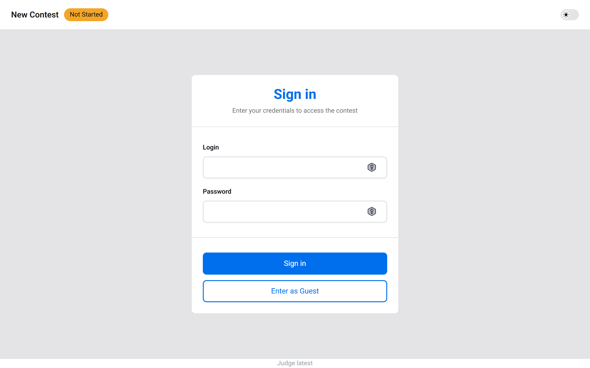

# Usage

This guide provides comprehensive instructions for using the Judge platform, covering both the command-line interface for contest administration and the web-based dashboard for different user roles.

## CLI

The Judge CLI tool (`./judge`) provides essential commands for Root administrators to manage the contest lifecycle. These commands enable quick contest operations directly from the command line.

### Contest Management

The CLI offers streamlined contest management operations for administrators. All commands require Root privileges to execute.

#### Creating a Contest

Create a new contest with a unique identifier:

```shell
./judge contest create <slug>
```

> **Note:** The `<slug>` must be unique and will be used in URLs and as the primary identifier for the contest.

#### Listing Contests

Display all contests in the system:

```shell
./judge contest ls
```

This command shows contest details including ID, slug, status, and timing information.

#### Starting a Contest

Force start a contest before its scheduled start time:

```shell
./judge contest start <contest-id>
```

> **Use Case:** Useful when you need to begin a contest immediately for testing or when schedules change unexpectedly.

#### Ending a Contest

Force end a contest before its scheduled end time:

```shell
./judge contest end <contest-id>
```

> **Warning:** This immediately terminates the contest. All submissions after this point will be rejected. Ensure all participants are notified before executing this command.

#### Deleting a Contest

Permanently delete a contest and all associated data:

```shell
./judge contest delete <contest-id>
```

> **Warning:** This action is irreversible and will remove all contest data, including submissions, clarifications, and announcements. Always create a backup before deleting a contest.

## Dashboard

The contest dashboard is the primary interface for all users during a contest, accessible at `https://judge.app`. The dashboard provides role-based views with different capabilities and access levels depending on the user's role: Root, Admin, Judge, Contestant, or Guest.

### Sign In

The authentication page where participants can sign in to access the contest. Users are automatically redirected to the appropriate dashboard based on their assigned role.



### Wait Page

A holding page that prevents non-administrative users (Judges, Contestants and Guests) from accessing the contest before its scheduled start time. This ensures fair competition by maintaining equal access timing for all participants.


> **Note:** Admin and Root users can access the dashboard at any time to prepare the contest environment and verify configurations.

### Admin / Root

Administrators and Root users have full control over contest management, with access to all features for monitoring, judging, and configuration.

#### Leaderboard

Displays the real-time classification and ranking of all contestants, showing solved problems, penalty times, and submission attempts. Use this view to monitor contest progress and identify leading participants.


**Key Features:**

- Real-time rank updates
- Detailed scoring breakdown per problem

#### Problems

Presents all problems available in the contest with their metadata, including difficulty indicators, submission counts, and acceptance rates.


**Key Features:**

- Problem statement access

#### Submissions

Provides a comprehensive view of all submissions across the entire contest. This is the central hub for submission management and quality control.


**Key Features:**

- Requeue submissions to the autojudge for re-evaluation
- Override automatic verdicts with manual judgments

#### Clarifications

Manages all clarification requests from contestants. Timely and accurate responses to clarifications are crucial for contest fairness and participant satisfaction.


**Key Features:**

- Review incoming clarification requests from contestants
- Create new clarifications

#### Announcements

Creates and manages contest-wide announcements to communicate important information to all participants.


**Key Features:**

- Review previouslly created announcements
- Create new announcement

#### Settings

Comprehensive contest configuration interface for managing all aspects of the contest, including timing, problems, and participant access.

> **Warning:** You can update an in-progress contest, but exercise extreme caution. Changes to timing, problems, or scoring rules during an active contest can compromise fairness and should only be made in exceptional circumstances with clear communication to all participants.

**Contest Settings:**


**Key Features:**

- Contest slug an title
- Start and end timestamps
- Configurations
- Controls

**Problem Management:**


**Key Features:**

- Add/remove problems from the contest
- Reorder problem display sequence
- Configure problem-specific settings (time/memory limits)
- Upload/update test cases

> **Note:** Test cases must be provided as a CSV file without headers, containing two columns: input and expected output. Each row represents one test case.

**Member Management:**


**Key Features:**

- Add participants with specific roles
- Modify user permissions
- Remove participants

### Judge

Judges have specialized privileges focused on evaluation and participant support, without the full administrative capabilities of Root/Admin users.

#### Leaderboard

Presents the current contest standings with the same comprehensive view available to administrators.


**Key Features:**

- Real-time rank updates
- Detailed scoring breakdown per problem

#### Problems

Displays all contest problems with detailed statistics to assist in evaluation and understanding submission patterns.


**Key Features:**

- Problem statement access

#### Submissions

Provides access to all contest submissions for evaluation purposes. Judges can rejudge submissions and apply manual verdicts when necessary.


**Key Features:**

- Requeue submissions to the autojudge for re-evaluation
- Override automatic verdicts with manual judgments

#### Clarifications

Enables judges to review and respond to contestant clarification requests, supporting the administrative team in maintaining communication.


**Key Features:**

- Review incoming clarification requests from contestants
- Create new clarifications

#### Announcements

Allows judges to create and publish announcements to communicate with participants.


**Key Features:**

- Review previously created announcements
- Create new announcements

### Contestant

Contestants have focused access to submit solutions, track their progress, and communicate with organizers.

#### Leaderboard

Displays the current standings, allowing contestants to monitor their position and compare their performance with other participants.


**Key Features:**

- Real-time rank updates
- Detailed scoring breakdown per problem

#### Problems

Shows all available problems in the contest with submission status indicators for quick navigation.


**Key Features:**

- Problem statement access
- Sample test cases

#### Submissions

The primary interface for creating new submissions and tracking their evaluation status.


**Key Features:**

- Submit solutions for evaluation
- Monitor real-time judging progress
- Review verdict and feedback

**Verdict Types:**

- **Accepted (AC)**: Solution passed all test cases
- **Wrong Answer (WA)**: Output doesn't match expected results
- **Time Limit Exceeded (TLE)**: Execution exceeded time limit
- **Runtime Error (RE)**: Program crashed during execution
- **Compilation Error (CE)**: Code failed to compile
- **Memory Limit Exceeded (MLE)**: Program exceeded memory limit

#### Clarifications

Enables contestants to request clarification on problem statements or contest rules when they encounter ambiguities.


**Key Features:**

- Review previously created clarifications
- Create new clarification requests

> **Tip:** Check existing clarifications and announcements before submitting a new request—your question may already be answered.

#### Announcements

Displays all contest announcements from organizers. Check this section regularly for important updates.


**Key Features:**

- View all announcements

### Guest

Guests have read-only access to observe the contest without participating. This role is ideal for spectators, media, or educational observers.

#### Leaderboard

View-only access to the current contest standings and participant rankings.


**Key Features:**

- Real-time rank updates
- Detailed scoring breakdown per problem

#### Problems

Browse all contest problems to understand the competition challenges, without the ability to submit solutions.


**Key Features:**

- Problem statement access
- Sample test cases

#### Submissions

Monitor all contest submissions in real-time, providing insight into participant activity and problem difficulty.


**Key Features:**

- View all submissions and verdicts

#### Clarifications

View all public clarifications to follow contestant questions and official responses.


**Key Features:**

- View all clarifications

#### Announcements

Access all contest announcements to stay informed about important updates and changes.


**Key Features:**

- View all announcements

## Contest Rules

Understanding the contest rules is essential for both participants and organizers to ensure fair competition and proper evaluation of submissions.

### Scoring and Ranking System

The platform uses a standard competitive programming ranking system based on the following criteria, applied in order:

**Primary Criteria:**

1. **Problems Solved**: Number of problems with accepted solutions
2. **Total Penalty Time**: Cumulative penalty calculated as:
   - 20 minutes added for each wrong submission before the first accepted solution
   - Plus the time elapsed (in seconds) from contest start to the accepted submission for each solved problem
3. **Acceptance Timestamps**: If tied on problems solved and penalty time, ranking is determined by the time of first acceptance, then second acceptance, and so on (measured in milliseconds for precision)
4. **Alphabetical Order**: As a final tiebreaker, participants are ordered alphabetically by name

**Important Rules:**

- Only the first accepted submission for each problem counts toward the final score
- Submissions made after a problem is already accepted do not affect penalty time or ranking
- Wrong submissions before acceptance add penalty time; wrong submissions after acceptance are ignored
- Time precision for penalty calculation is in seconds; tiebreakers use millisecond precision

> **Example:** If a contestant solves a problem at 45:30 (45 minutes, 30 seconds) after 2 wrong attempts, their penalty for that problem is: 45 minutes + 30 seconds + (2 × 20 minutes) = 85 minutes and 30 seconds.
