# Admin Dashboard

The Admin Dashboard provides comprehensive control over all aspects of a contest. Administrators have full access to manage contests, problems, submissions, and participants.

## Leaderboard

View the current standings of all participants in the contest. The leaderboard displays participant rankings, scores, and problem-solving statistics. When the leaderboard is frozen, the view remains static.

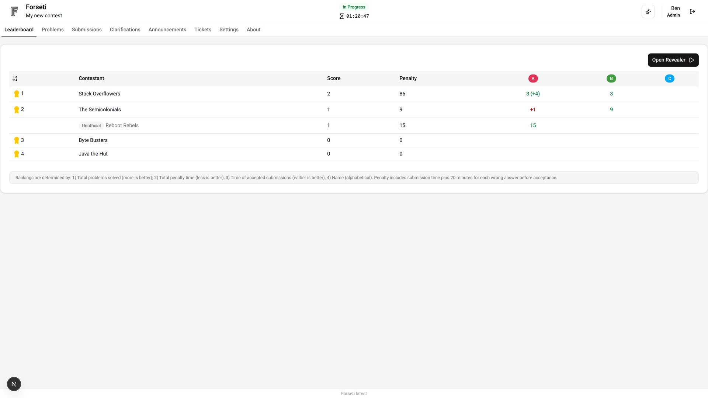

### Leaderboard Revealer

The leaderboard revealer feature allows administrators to dramatically unveil the final standings during award ceremonies. This animated revelation can be controlled line by line to build suspense and engagement. Unoficial contestants are hidden from this view to maintain the integrity of the official rankings.

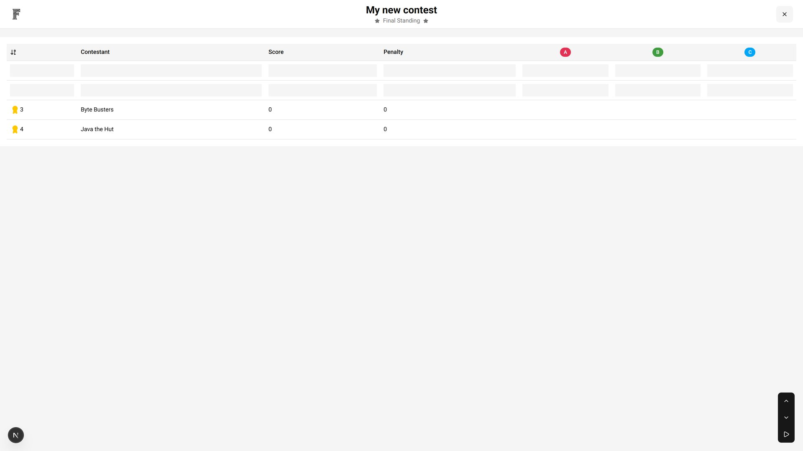

## Problems

View all contest problems including their description, constraints and test cases.

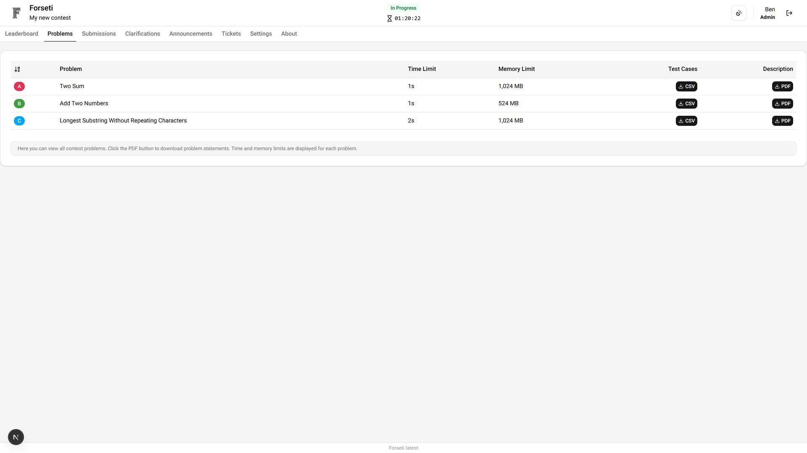

## Submissions

View and manage all participant submissions throughout the contest. This comprehensive interface allows administrators to monitor submission activity, download source code, list autojudge executions, resubmit and manually judge.

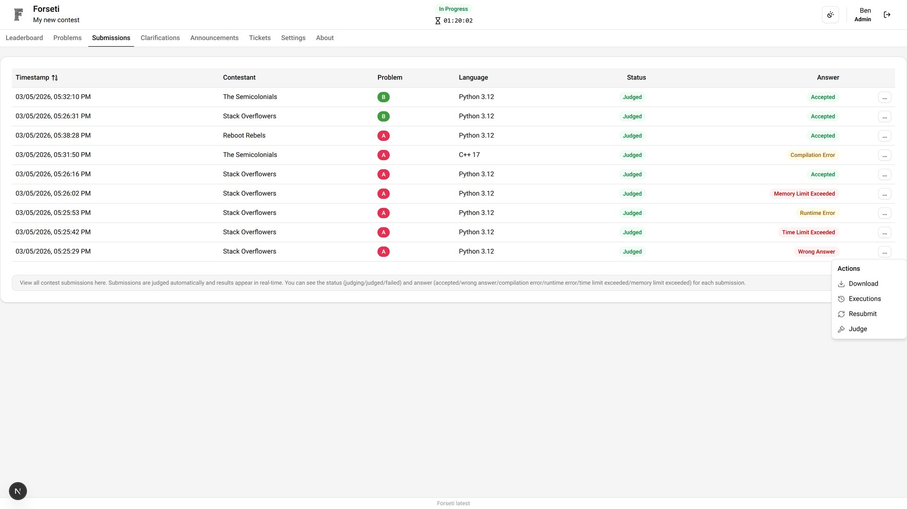

## Clarifications

Manage participant questions and provide official responses. The clarification system ensures fair communication and consistent rule interpretation throughout the contest.

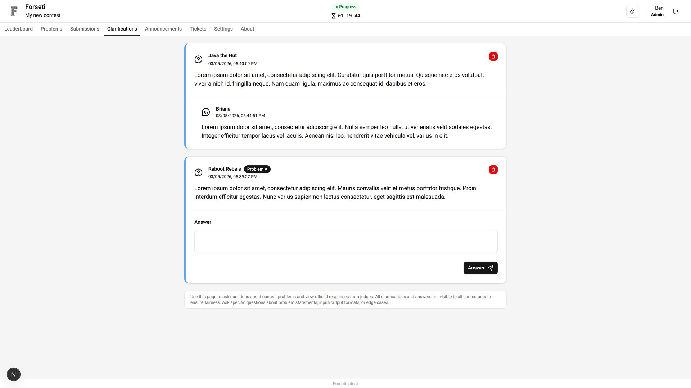

## Announcements

Create and manage contest-wide announcements to communicate important information to all participants. Announcements appear prominently in all user interfaces.

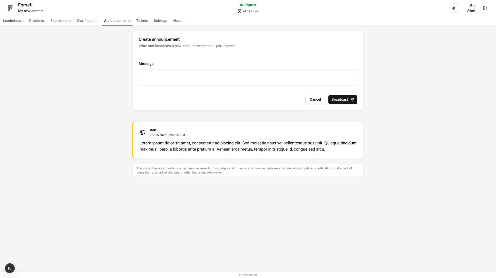

## Tickets

Manage support tickets and issues raised by participants. The ticketing system provides structured communication for technical and non-technical problems.

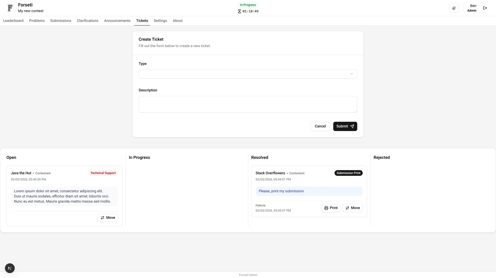

## Settings

Configure all aspects of the contest through comprehensive settings panels. These controls allow fine-tuning of contest behavior, problems, and members management.

### Contest Settings
Control fundamental contest parameters including timing, scoring rules, and access permissions.

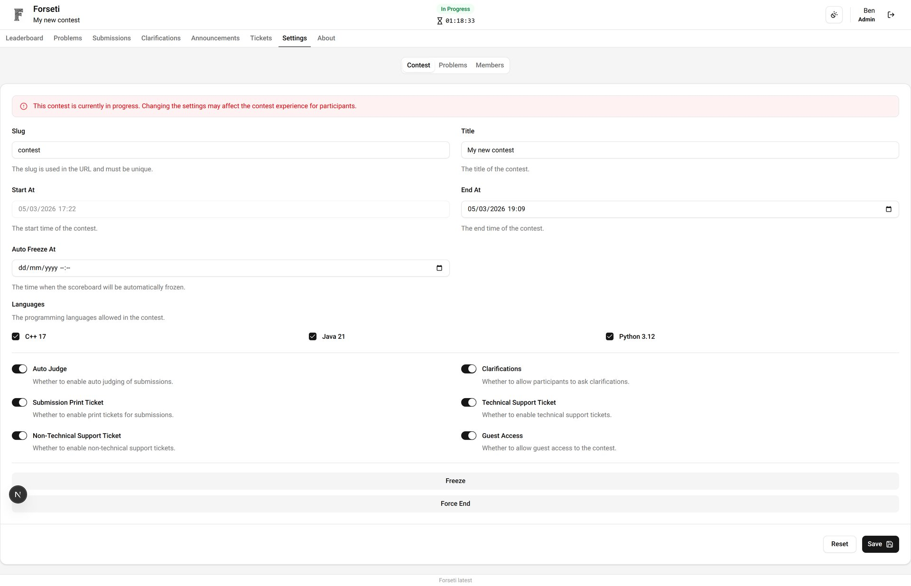

### Problem Settings
Manage problem configurations, including adding new problems, editing existing ones, or deleting problems from the contest. This interface allows administrators to maintain the problem set effectively throughout the contest lifecycle.

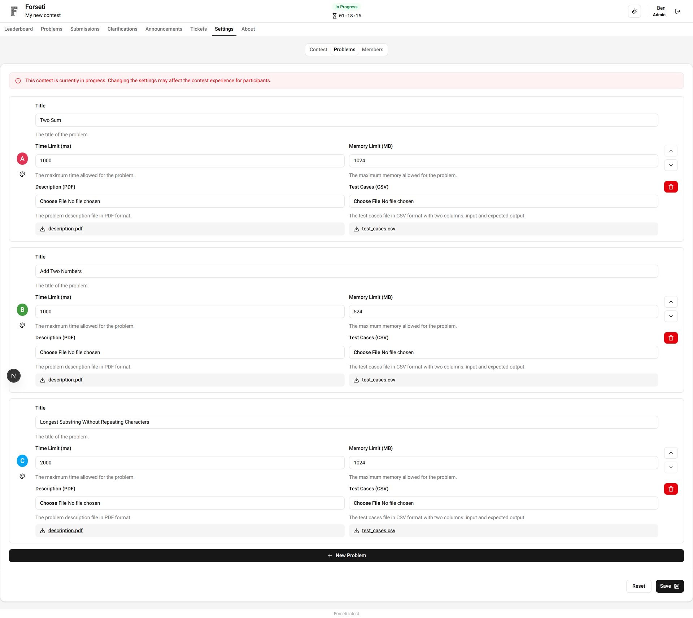

### Member Settings
Administer member accounts, including adding new members, editing existing member information, and managing permissions. This interface ensures that the right people have the appropriate access to contest features.

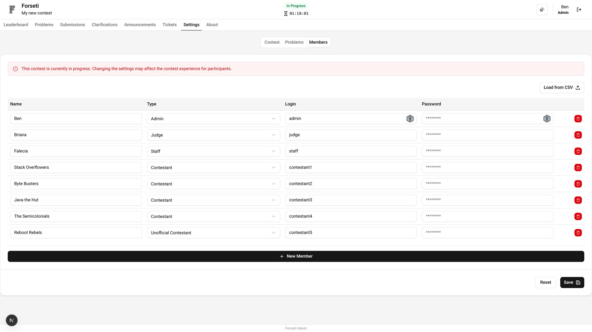

## About

View comprehensive contest information including rules, schedules, and administrative details. This page provides context and reference information for both administrators and participants.

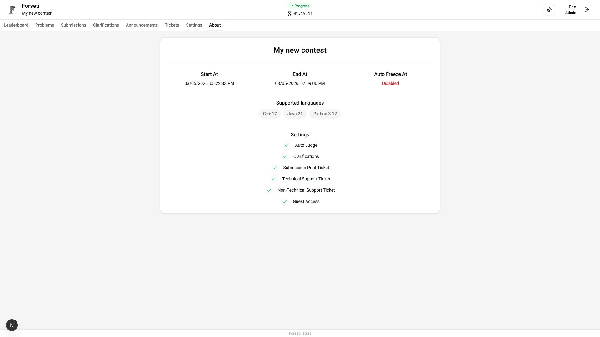
