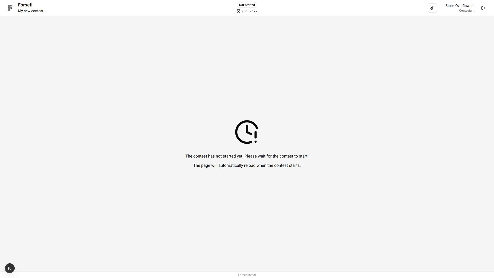
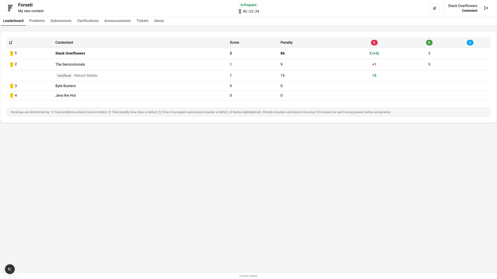
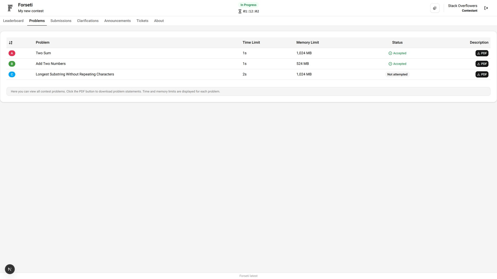
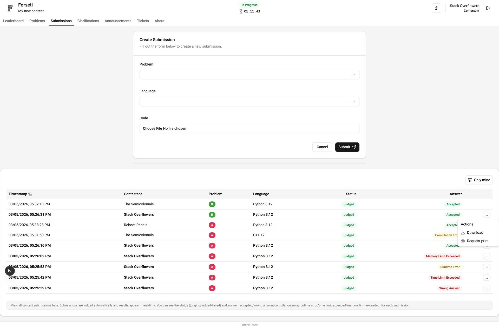
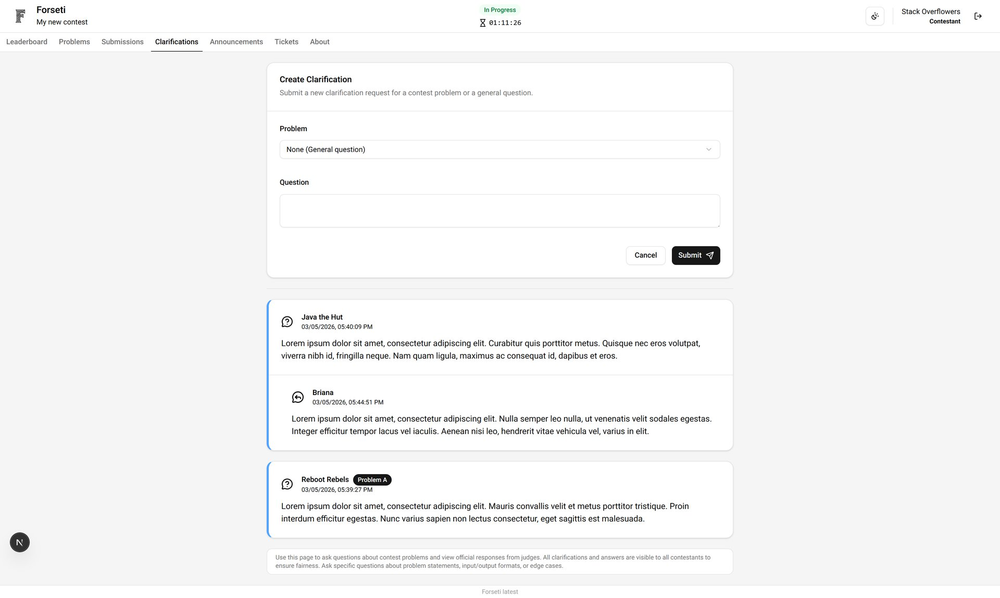
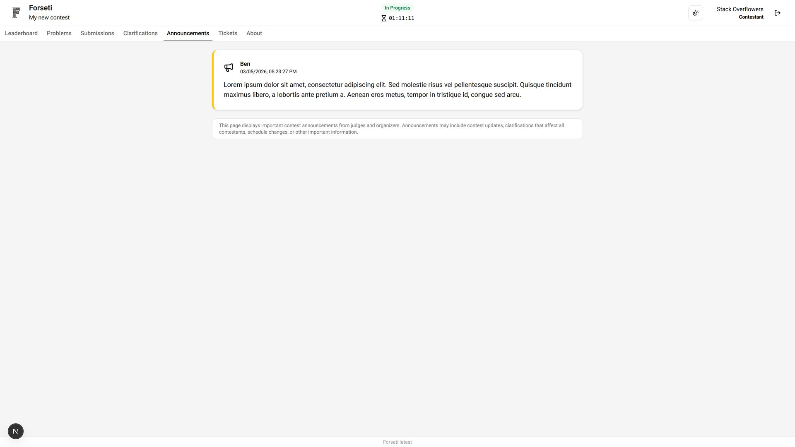
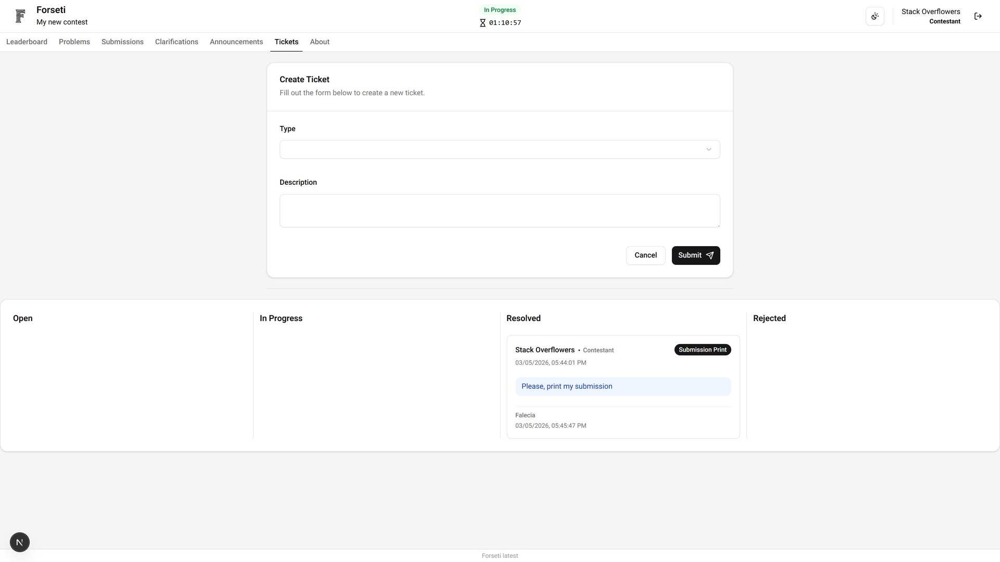
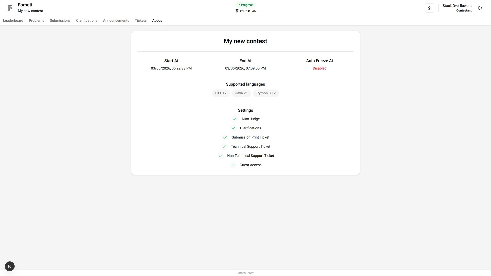

# Contestant Dashboard

The Contestant Dashboard provides all the tools participants need to compete effectively. Contestants can view problems, submit solutions, track their progress, and communicate with organizers.

## Wait Page

When the contest has not started, contestants see a wait page until the contest starts.

## Leaderboard

View your current ranking and compare your performance with other participants. The leaderboard shows real-time standings until it's frozen near the contest end.

## Problems

Access all contest problems with detailed description and constraints.

## Submissions

Submit your solutions and track their evaluation status. View detailed feedback on your submissions including compilation errors, runtime results, and scoring. Download your submitted source code for review and improvement or request a printout of your submission code.

## Clarifications

Ask questions about problem statements or contest rules. Receive official responses from contest organizers and view public clarifications that benefit all participants.

## Announcements

Stay informed with important contest updates, rule changes, and system notifications. All announcements appear prominently in your dashboard.

## Tickets

Report technical issues or request assistance from contest support. Use the ticketing system for problems that require administrative intervention.

## About

Access contest information including rules, schedule, and technical requirements. This reference section helps you understand contest procedures and policies.

