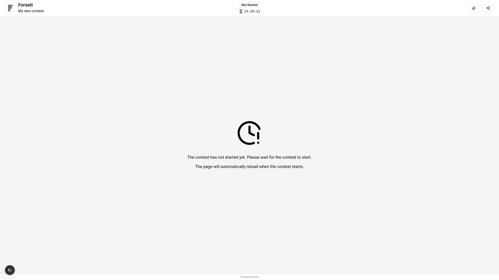
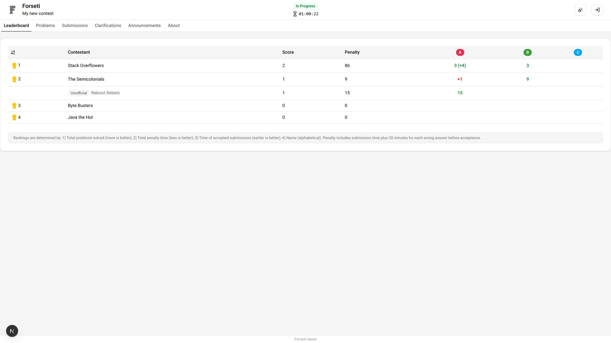
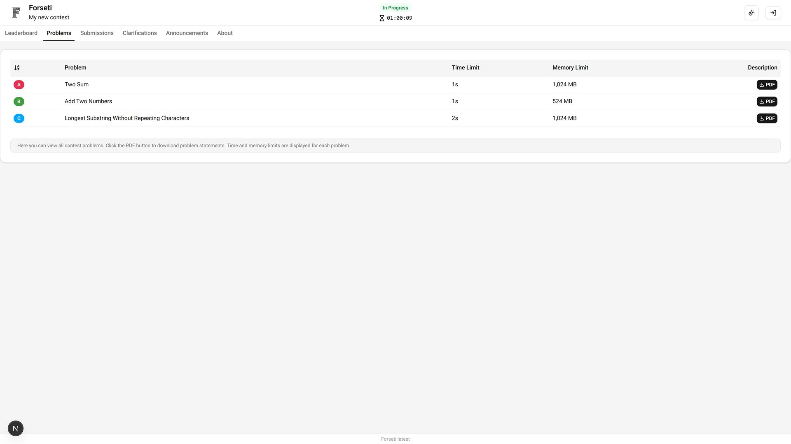
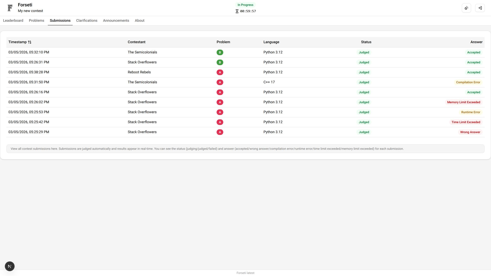
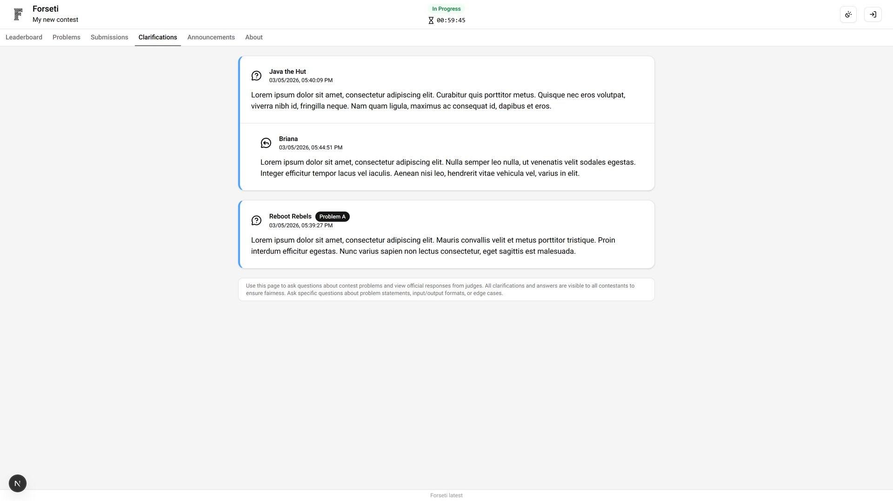
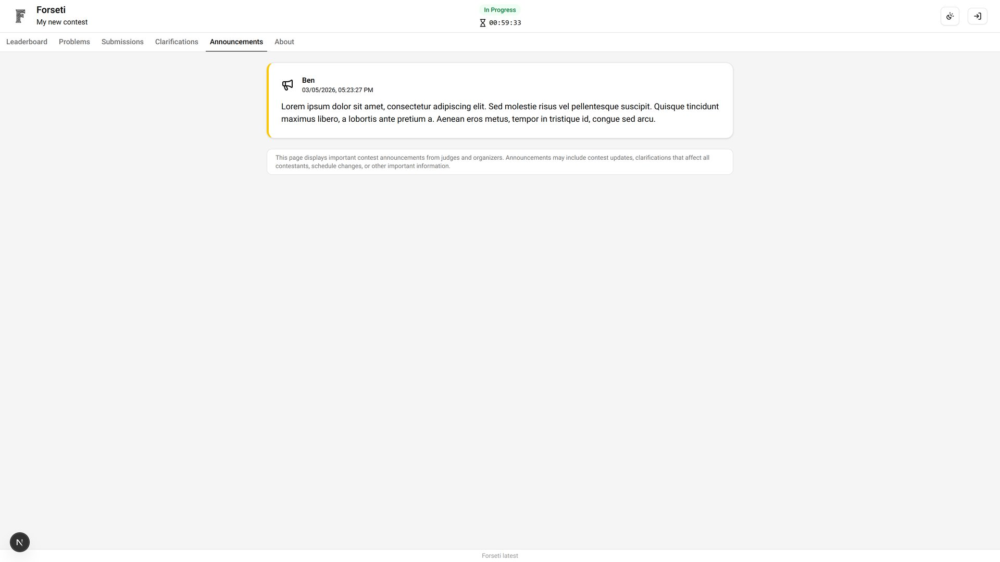
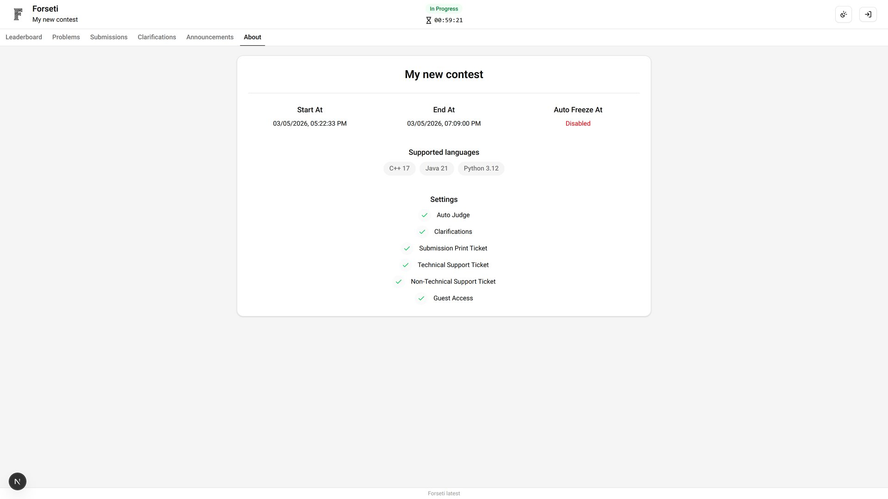

# Guest Dashboard

The Guest Dashboard provides read-only access to contest information. Guests can observe the competition without participating directly, making it ideal for spectators and interested observers.

## Wait Page

When the contest has not started, guests see a wait page until the contest starts.

## Leaderboard

View the current contest standings and participant progress. Guest access shows the same leaderboard visible to contestants, including any freezing that may be in effect.

## Problems

Access contest problem description and specifications. This allows guests to understand what challenges participants are solving.

## Submissions

View general submission statistics and activity patterns without accessing specific participant code or detailed results.

## Clarifications

View public clarifications and official announcements that have been made available to all participants.

## Announcements

Access all public contest announcements and important updates. This keeps guests informed about contest progress and any significant events.

## About

View basic contest information including public rules, schedule, and general information about the event.

