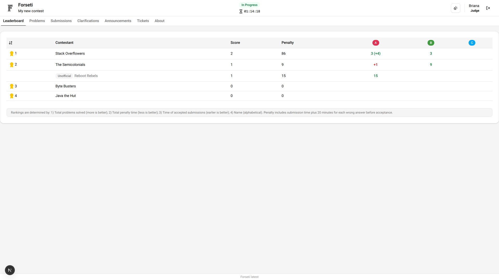
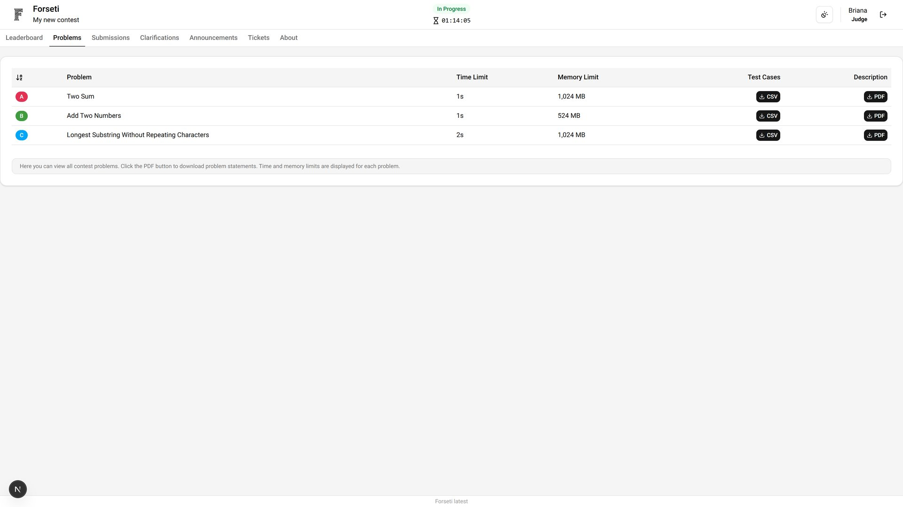
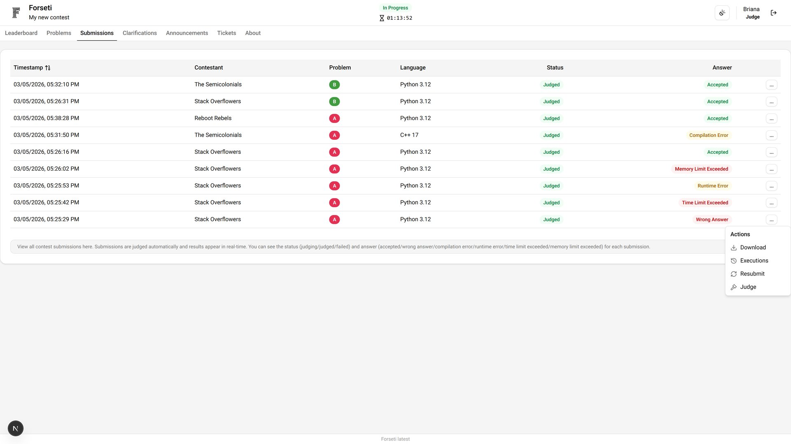
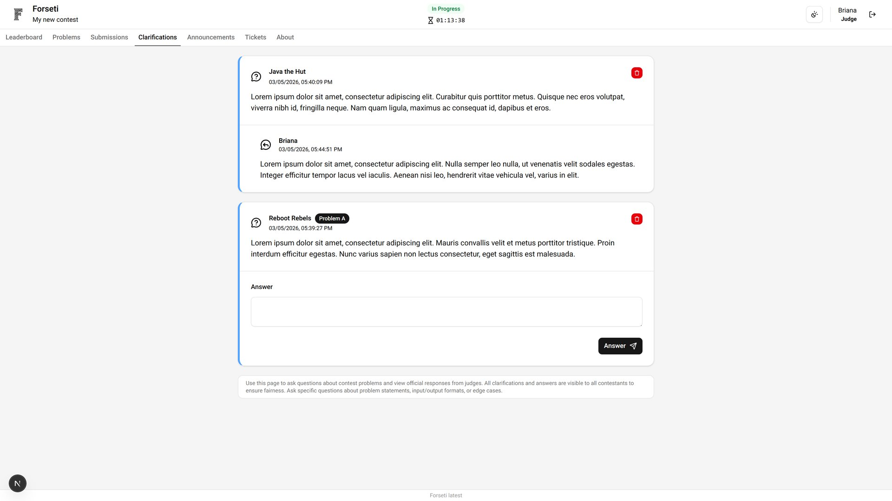
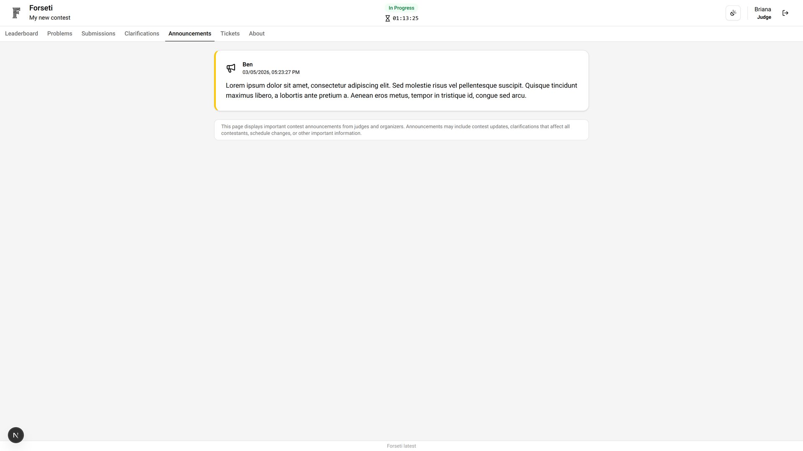
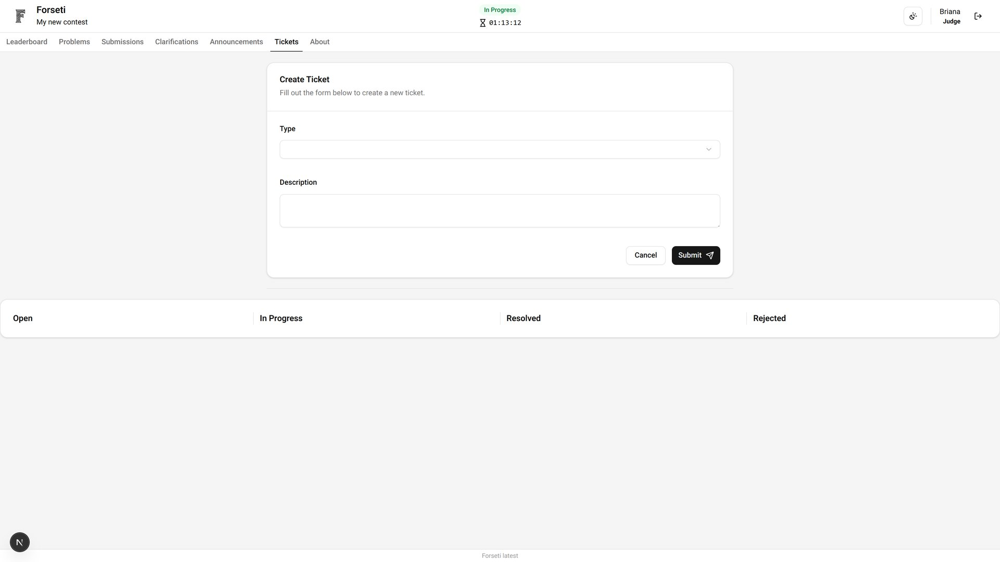
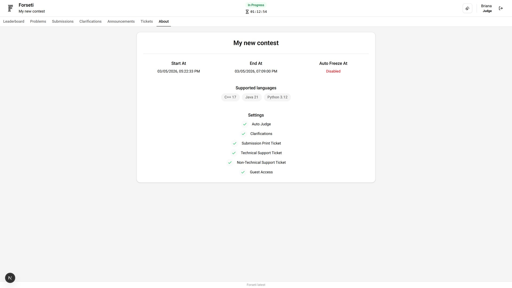

# Judge Dashboard

The Judge Dashboard provides specialized tools for contest judges to evaluate submissions, handle clarifications, and maintain contest integrity. Judges have focused access to judging and communication functions.

## Leaderboard

Monitor contest standings with judge-level access to understand competition progress and identify potential issues requiring attention.

## Problems

Access detailed problem information necessary for accurate judging and clarification responses. Judges need comprehensive problem knowledge to make consistent decisions.

## Submissions

Evaluate participant submissions with comprehensive judging tools. This is the primary interface for manual judgment and submission review. Judges can download source code, list autojudge executions, resubmit submissions, and manually set an answer.

## Clarifications

Respond to participant questions with authoritative and consistent answers. Judges ensure fair interpretation of rules and problem statements.

## Announcements

Access contest announcements important for all participants, including those relevant to judging and contest administration.

## Tickets

Report technical issues or request assistance from contest support. Use the ticketing system for problems that require administrative intervention.

## About

Access comprehensive contest and judging information including detailed rules, procedures, and guidelines necessary for consistent judgment.

