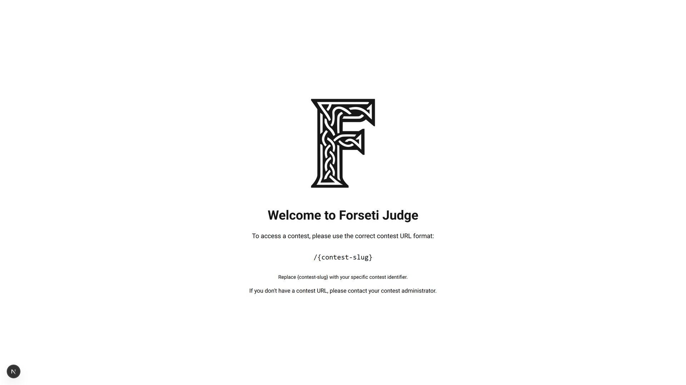
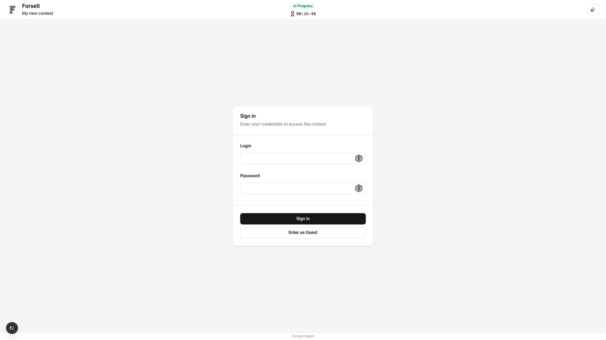

# WebApp Overview

The Forseti WebApp provides a comprehensive interface for managing and participating in competitive programming contests. The web application supports multiple user roles with tailored dashboards and appropriate access controls.

## Home Page

The home page is located at `http[s]://{domain}/`. This landing page serves as an entry point to the platform but does not contain contest-specific content. Users must navigate to a specific contest page at `http[s]://{domain}/{contest_slug}` to access contest functionality.

## Sign In Page

The sign-in page is accessed at `http[s]://{domain}/{contest_slug}/signin`. This page provides authentication for all contest members.

