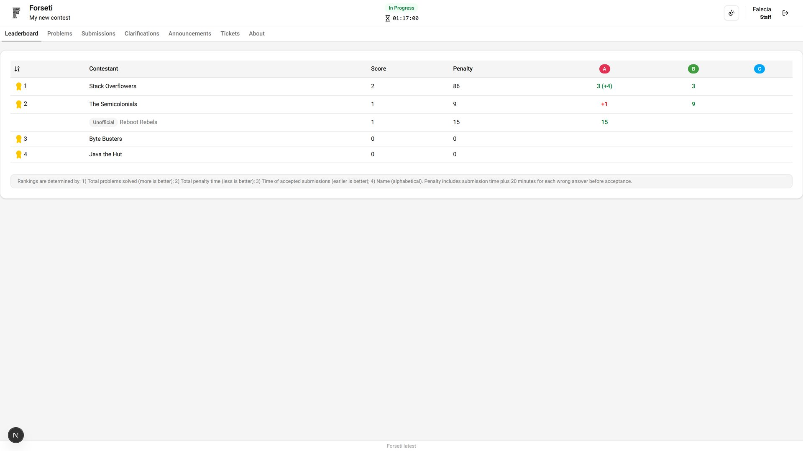
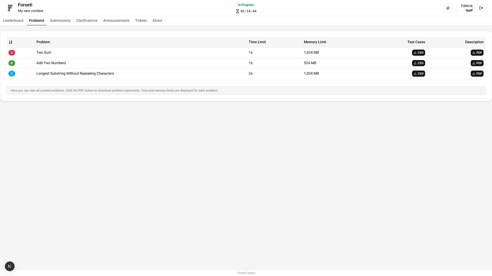
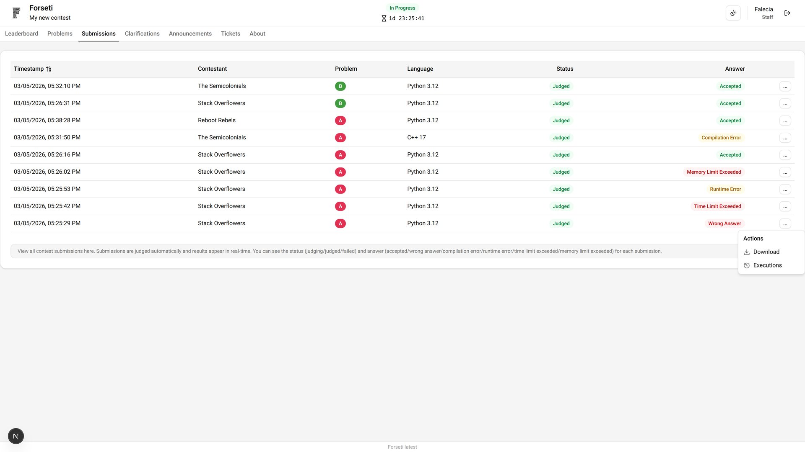
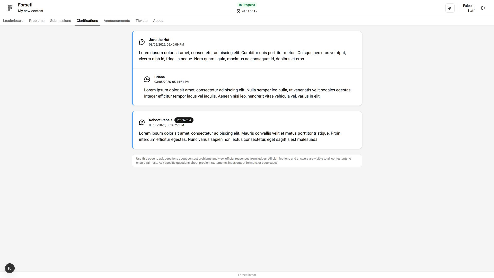
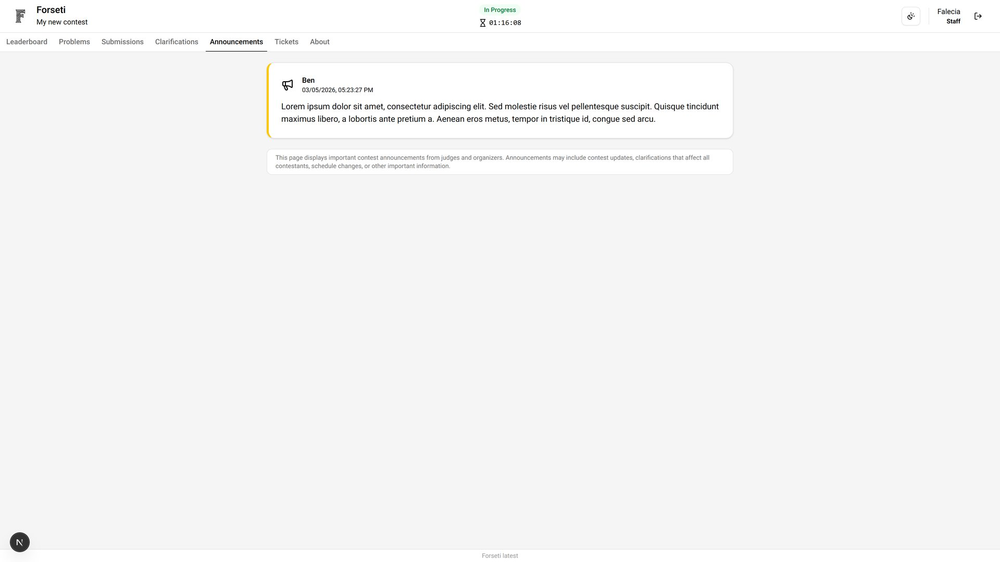
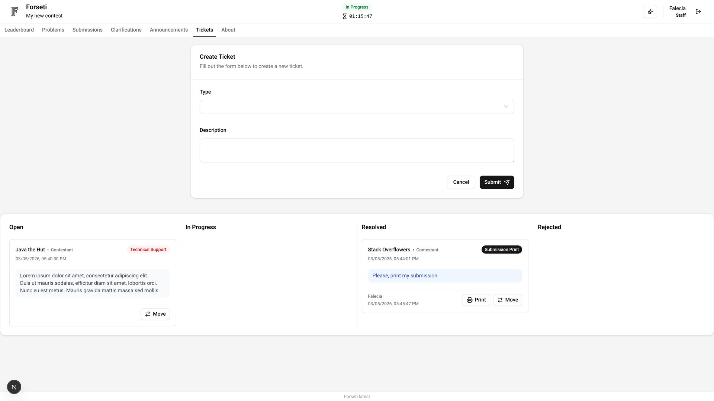
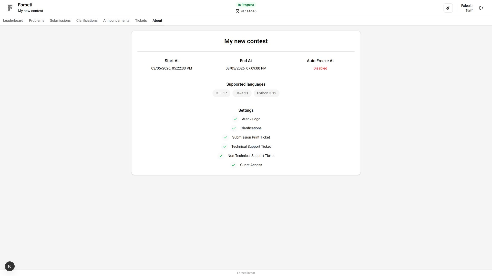

# Staff Dashboard

The Staff Dashboard provides comprehensive contest management capabilities for contest organizers and volunteers. Staff members have elevated permissions to assist with contest administration while maintaining appropriate access controls.

## Leaderboard

View the current standings of all participants in the contest. The leaderboard displays participant rankings, scores, and problem-solving statistics. When the leaderboard is frozen, the view remains static.

## Problems

View all contest problems including their description, constraints and test cases.

## Submissions

View general submission statistics and activity patterns. Download submission code and list auto judge executions.

## Clarifications

View public clarifications and official announcements that have been made available to all participants.

## Announcements

Access all public contest announcements and important updates. This keeps guests informed about contest progress and any significant events.

## Tickets

Handle participant support requests and technical issues. Staff can manage the support workflow and create tickets as needed.

## About

Access comprehensive contest information and administrative details necessary for effective staff operations.

